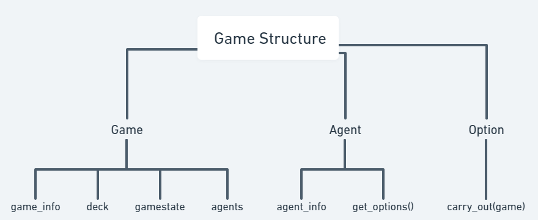

# CITADELS_self_play

## Table of Contents

- [Introduction](#introduction)
- [Structure](#structure)
- [Usage](#usage)

## Introduction 
This is my hobby project for creating an agent that can play the board game [Citadels](https://www.ultraboardgames.com/citadels/deluxe.php) against itself. The game and the algorithms are both coded from scratch. The goal is to create an agent that can play the game at a high level.

## Structure 
#### Game
Game is made out of 3 main classes: 'Game', 'Agent' and 'Option'. Where the game contains the public informations, the agent the private informations, while also having a get_options function that based on the game returns all the options the agent can choose from. The option class contains the information about the option, while also containing a carry_out function, that brings the game from one state to another. All of this is in the game folder.

---
#### Algorithms
Algorithms contains the self-play methods. Currently the only implemented algorithm is the deep learing assisted monte carlo CFR. Due to the complexity of the action space in citadels, the neural network only predicts the value in a given state, while the policy traditionally.

## Usage 
To start from zero run train_from_scratch.py. Still mostly work in progress, but should work.