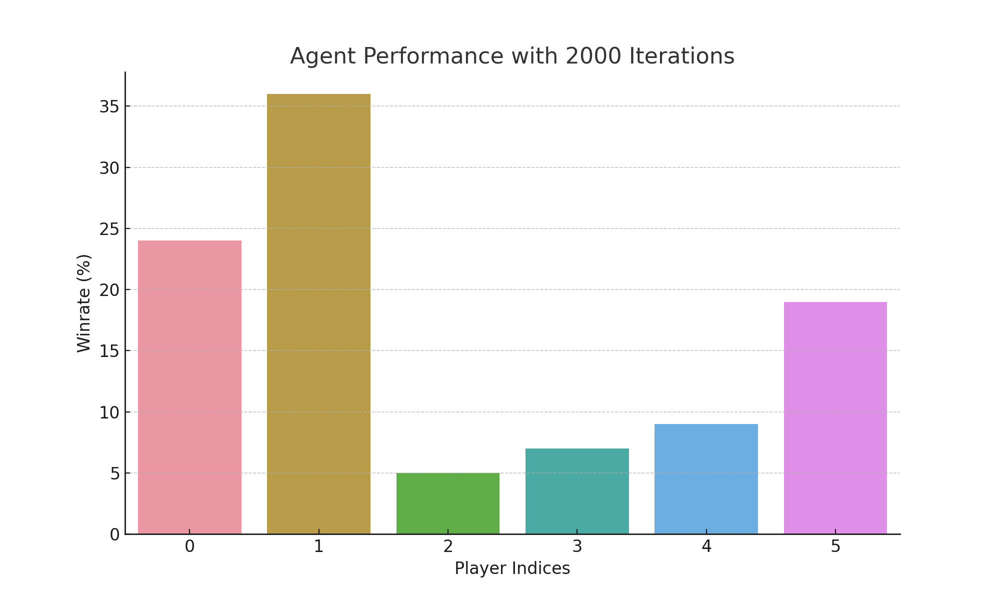
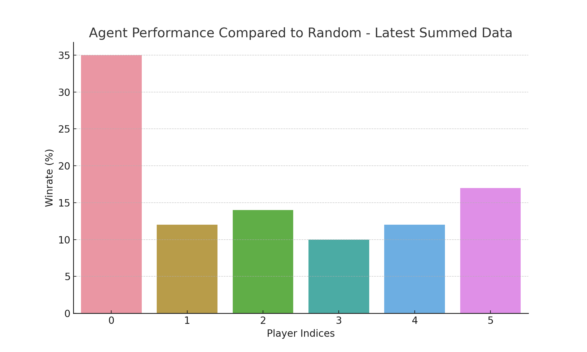
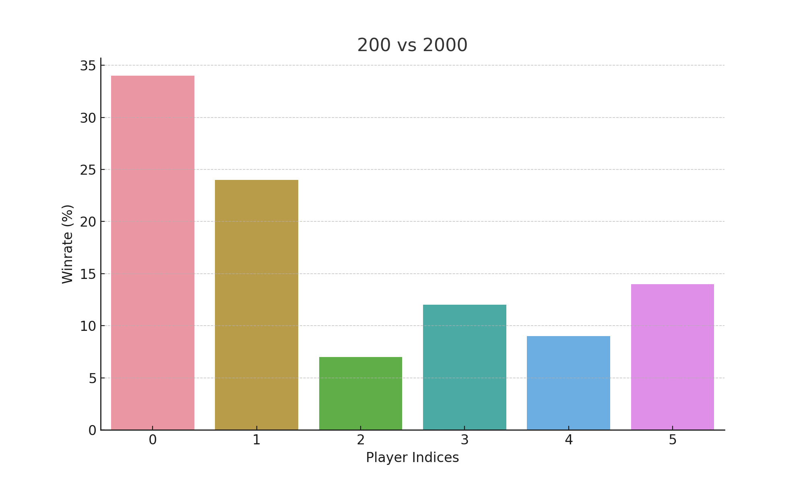
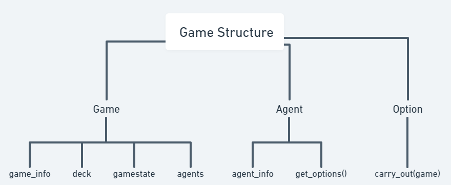

# CITADELS self play

## Table of Contents

- [Introduction](#introduction)
- [Results](#results)
- [Code Structure](#structure)
- [Usage](#usage)
- [Training method](#training)
- [Chellenges](#chellenges)


## Introduction <a name = "introduction"></a>
This is my hobby project for creating an agent that can play the board game [Citadels](https://www.ultraboardgames.com/citadels/deluxe.php) against itself. The game and the algorithms are both coded from scratch. The goal is to create an agent that can play the game at a high level. I made the simplification that the game is always played by 6 people, and currently only with a set cards, set characters, and the first player is always the player number 4. an I implemented the deep learning assisted [MCCFR](https://arxiv.org/pdf/1811.00164.pdf).


## Results <a name = "results"></a>

An agent (index 0) with the MCCFR algo with a trained model, an agent (index 1) with only the pure MCCFR algo and no deep learning and 4 agent deciding randomly were made to play against each other. For the first experiment the algos could calculate a gametree for 2000 iterations, which translates to having around 10 secounds to think about each move with my setup. The deep learning assisted MCCFR also calculated the subtree for maximum 100 moves deep before using the model to backpropagate the model guessed node values.  The chart shows the winrates of each agents after playing 100 games.



Its clear that, that while having 10 secounds to think about each decision, the deep learning model is more of a hinderence, altough clearly better than random guessing.

---

For the next experiement the only difference was that the algos could only calculate the gametree for 200 moves, which translates to around 1 secound. The deep learning assited MCCFR only calculated the subtree for 10 moves deep this time.



This time having a random guess for the node values by the model proved to be very useful, while it looks like 200 moves for the regular MCCFR is not really sufficient for anything.

---

For the last part I compared the two different method from before, so the index 0 agent used the model, had 200 iterations to calculate a gametree, and the models node value predictions where used at depth 10. For the index 1 agent used MCCFR with no model, but having 2000 iterations to calculate a gametree, the rest of the agents where random



This time surprisingly the deep MCCFR won the most games. The results could be skewed by realatively low game count (100) and the fact that the first agent to have the crown in the very first round in each game is always the agent at index 3. Considering everything the deep learning assisted MCCFR is a very effective method to create an AI that plays citadels well.

## Code Structure <a name = "structure"></a>
#### Game
Game is made out of 3 main classes: 'Game', 'Agent' and 'Option'. Where the game contains the public informations, the agent the private informations, while also having a get_options function that based on the game returns all the options the agent can choose from. The option class contains the information about the option, while also containing a carry_out function, that brings the game from one state to another. All of this is in the game folder.


---
#### Algorithms
Algorithms contains the self-play methods. Currently the only implemented algorithm is the deep learing assisted monte carlo CFR. Due to the complexity of the action space in citadels, the neural network only predicts the value in a given state, while the policy is calculated from scratch.

## Usage <a name = "usage"></a>
1. Install pytorch, and requirements.txt:
```python
pip install torch==2.1.0 torchvision==0.16.0 torchaudio==2.1.0
pip install -r requirements.txt
```
2. Generate test data pickle file
```python
python generate_test_data.py
```
3. Start training
```python
python train_from_scratch.py
```
4. Test against random opponent
```python
python compare_to_random.py 
```


## Training method <a name = "training"></a>

#### MCCFR data generation
For validation I decided to create nodes with well calculated policies and values. I did this by creating games, playing them randomly to completion, then step back 0-20 steps and run the CFR on that state. After this only using the root of the game tree. This ensures that the strategy values settled to a good strategy and node values reflect the reality without being meaningless uniform distributions.

After generating validation data, in a similar fashion I created training data, playing games randomly to completion, then taking 0-100 steps back, and running CFR on that state. The training data is any game node that is backpropagated at least 200 times.

#### Training a neural network to help the algorithm
In the original deep MCCFR the NN helps by making an initial guess at the node values and strategies. In my version I made attempts to get a sequence to probabilty distribution transformer model to do this but It never managed to learn anything really, so I settled with a linear NN making predictions only at the winning probablities and not the strategies.


## Chellenges <a name = "chellenges"></a>
As I understand, MCCFR has a hard time to deal with fully private decisions, like picking the roles at the start of each citadel round. The problem is that the decision doesn't change anything about the public information, what it changes is:
- the picking players role
- the next players options to chose from
- the picking players knowledge based on the role cards he got and the role card he gives forward

All of these are private informations, if I just sample it away I'm going to make the rolepick decison inconsequential.


#### The proposed solution
I treated the whole rolepick phase as a single node where everyone is playing. This means the strategy, the values and the regrets are [player_num, option_num] shaped matrices intsead of [1, option_num] shaped vectors in these kind of nodes. The options in this node a sampled through playing 10 role pick phases randomly, resulting in 10 child nodes. At the end of the role picking, the child nodes are set up by setting up the first roles player (so for example the player who picked the assasin if thats the number 1 role), then sampling roles based on that players knowledge of what the other players could be (this knowledge is based on the orders the players sit, who has the crown and the role cards the player could pick from). The role pick decisions are reflected in this players anticipations of what the other players roles could be.


The strategy matrices are used by taking their weighted average on their first axis and turning them into a [1, option_num] shaped vector just like the rest. To simulate the advantage of picking sooner, the averaging is weighted [6, 5, 4, 3, 2, 1], where 6 is the weight of the crowned player and 1 is the weight of the last player.


